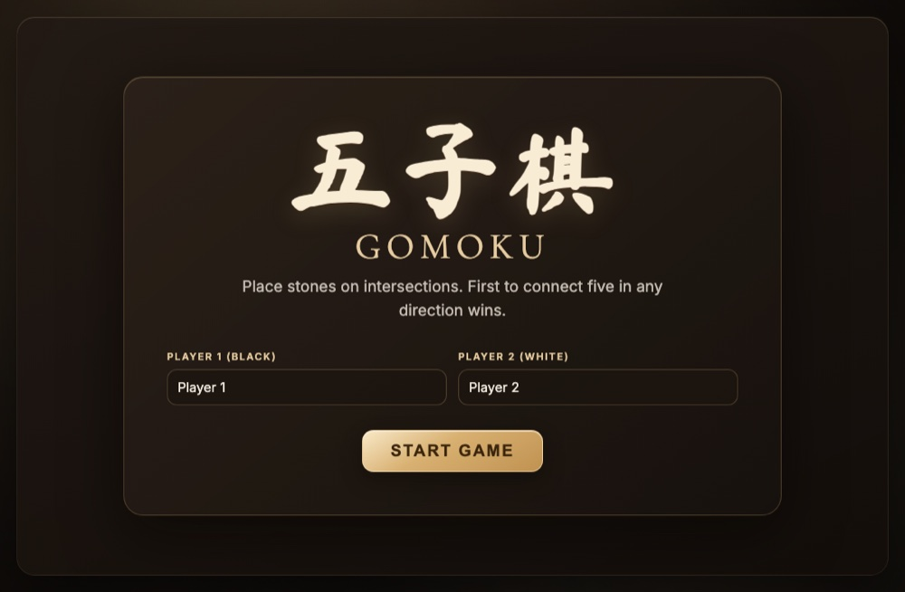

# Gomoku (五子棋) - Single File Web App

**▶ [Play now](https://renrenmimi.github.io/Gomoku/)** — runs in your browser, nothing to install.

A local two-player Gomoku game built as a single `index.html` file for direct deployment to GitHub Pages.

## Features

- 19x19 board with traditional intersection placement
- Two-player local play (Black vs White)
- Win detection for 5+ in a row (horizontal, vertical, diagonal)
- Winning stones highlight + animated golden connecting line
- Undo last move, new game reset, and match score tracking
- Start screen with optional player names
- iPad-friendly touch targets and interaction settings
- Optional Web Audio effects (place / undo / win)

## Tech

- React 18 via CDN
- Babel standalone (JSX in browser)
- Inline CSS + JS, no build tools
- No external images

## Deploy

Upload `index.html` (and optionally this `README.md`) to your GitHub Pages repository root.
